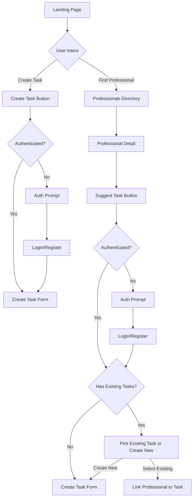
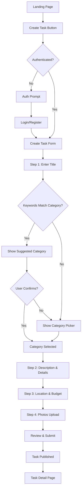
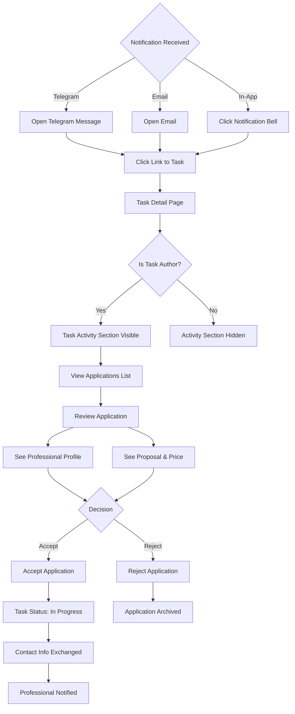
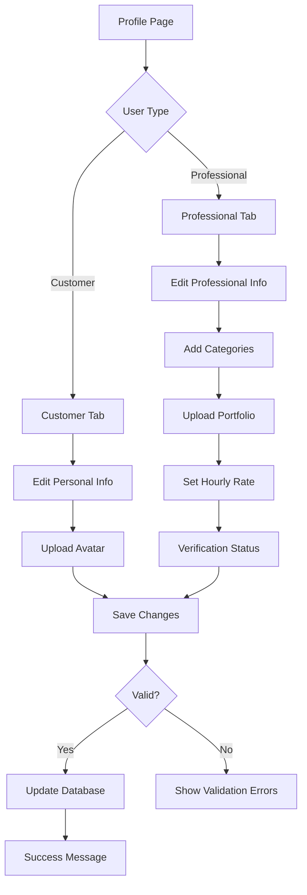
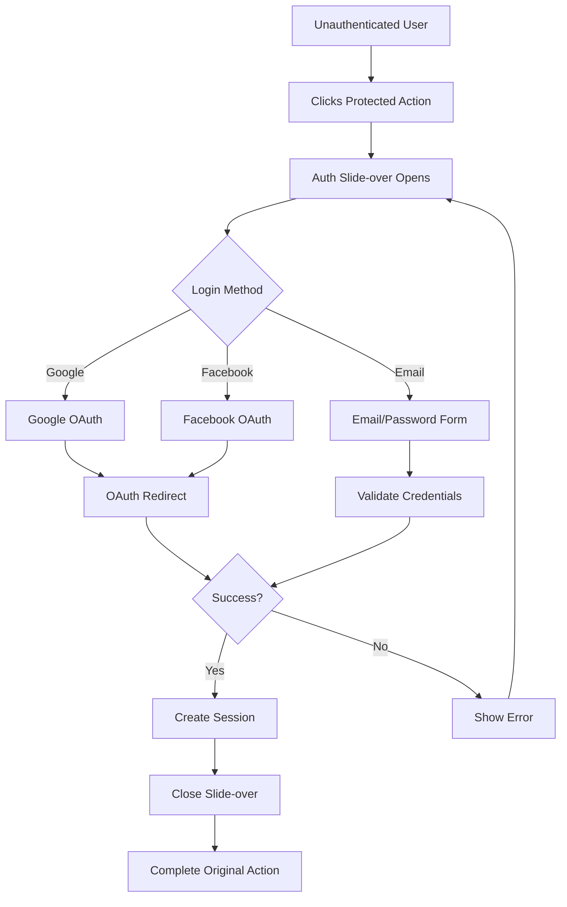

# Customer Journeys

> User flow diagrams for customers using TaskBridge (Trudify) platform.

This document describes the main user journeys for customers who want to find professionals and get work done.

## Table of Contents

- [Finding and Hiring a Professional](#finding-and-hiring-a-professional)
- [Posting a Job](#posting-a-job)
- [Managing Applications By Customer](#managing-applications-by-customer)
- [Task Completion & Review](#task-completion--review)
- [Profile Management](#profile-management)
- [Authentication Flow](#authentication-flow)

---

## Finding and Hiring a Professional

How customers discover and connect with professionals for their service needs.



### Key Steps

1. **Discovery**: Customer lands on homepage and decides their intent
2. **Path A - Create Task**: Click create task, authenticate if needed, fill out task form
3. **Path B - Find Professional**: Browse directory, view professional profile, suggest a task
4. **Task Assignment**: Either create a new task or link professional to an existing task
5. **Connection**: Professional receives notification about the suggested task

---

## Posting a Job

The complete flow for customers creating a new service request.



### Form Steps

| Step | Purpose | Required Fields |
|------|---------|-----------------|
| 1 | Title & Category | Task title (category auto-suggested or manual pick) |
| 2 | Description | Detailed description, requirements |
| 3 | Location & Budget | City, neighborhood, budget range |
| 4 | Photos | Upload task-related images (optional) |

### Step 1: Smart Category Matching

The system uses keyword-based matching to suggest categories automatically:

1. **User enters title** (e.g., "Fix leaking pipe in bathroom")
2. **Algorithm scans keywords** against category database
3. **If match found**: Shows suggested category for confirmation
4. **If no match**: Shows full category picker for manual selection
5. **User can always override** the suggestion and pick manually

**Example Keyword Mappings:**
| Keywords | Suggested Category |
|----------|-------------------|
| pipe, leak, faucet, drain | Plumber |
| outlet, wiring, switch | Electrician |
| lock, door, key | Locksmith |
| paint, wall, ceiling | Painter |

### Post-Creation

After publishing, customers can:
- View their task on the detail page
- Share the task link
- Monitor incoming applications

---

## Managing Applications By Customer

How task owners (customers) review and manage applications from professionals.



### Notification Channels

| Channel | Description |
|---------|-------------|
| **Telegram** | Instant notification with direct link to task |
| **Email** | Email notification with task details and link |
| **In-App** | Notification bell shows new application alert |

### Application States

| Status | Description | Customer Actions Available |
|--------|-------------|---------------------------|
| **Pending** | New application awaiting review | View, Accept, Reject |
| **Accepted** | Professional hired for the task | Contact, Start work |
| **Rejected** | Application declined | None (archived) |

### Review Flow

When reviewing an application:
1. Receive notification via Telegram, Email, or In-App
2. Click link to open Task Detail Page
3. Task Activity section shows applications (visible only to task author)
4. Review professional's profile and proposal
5. Accept or reject the application

### After Acceptance

1. Task status changes to "In Progress"
2. Contact information is exchanged between parties
3. Professional receives acceptance notification

---

## Task Completion & Review

How customers complete tasks and leave reviews for professionals.

```mermaid
graph TD
    A{Who Initiates Completion?}

    A -->|Customer| B[Customer Initiates]
    A -->|Professional| C[Professional Initiates]

    %% Customer-initiated flow
    B --> D{Access From}
    D -->|Posted Tasks Page| E[/tasks/posted]
    D -->|Task Detail Page| F[/tasks/id]

    E --> G[Click Mark Complete]
    F --> G

    G --> H[Task Status: Completed]
    H --> I[Review Prompt Shown]
    I --> J[Customer Leaves Review]
    J --> K[Review Saved]

    %% Professional-initiated flow
    C --> L[Professional Marks Complete]
    L --> M{Notification Received}
    M -->|Telegram| N[Open Telegram Message]
    M -->|Email| O[Open Email]
    M -->|In-App| P[Click Notification Bell]

    N --> Q[Click Link to Reviews]
    O --> Q
    P --> Q

    Q --> R[/reviews/pending Page]
    R --> S[Review & Confirm Completion]
    S --> T[Task Status: Completed]
    T --> U[Professional Notified]
```

### Two Completion Paths

| Path | Initiated By | Notification Sent | Review Flow |
|------|--------------|-------------------|-------------|
| **Customer-initiated** | Customer | None (professional already knows) | Review prompt shown immediately |
| **Professional-initiated** | Professional | Customer notified to review | Customer confirms via `/reviews/pending` |

### Customer-Initiated Completion

When the customer marks the task complete:

1. **Access**: Go to `/tasks/posted` OR task detail page
2. **Action**: Click "Mark as Complete" button
3. **Result**: Task status changes to `completed`
4. **Review**: Customer is prompted to leave a review
5. **No notification**: Professional is not notified (they already know the work is done)

### Professional-Initiated Completion

When the professional marks the task complete:

1. **Trigger**: Professional clicks "Mark Complete" on their end
2. **Notification**: Customer receives notification via Telegram/Email/In-App
3. **Link**: Notification contains link to `/reviews/pending`
4. **Review**: Customer reviews the work and confirms completion
5. **Confirmation**: Task status changes to `completed`
6. **Notification**: Professional receives confirmation notification

### Review Prompt

When completing a task, customers are asked to:
- Rate the professional (1-5 stars)
- Write an optional review comment
- Confirm the final price paid (if different from proposal)

---

## Profile Management

Managing customer account and profile information.



### Customer Profile Fields

| Field | Description | Required |
|-------|-------------|----------|
| First Name | User's first name | Yes |
| Last Name | User's last name | Yes |
| Email | Contact email | Yes |
| Phone | Contact phone number | No |
| City | Primary location | Yes |
| Avatar | Profile picture | No |

### Verification Options

Customers can verify their identity through:
- **Phone verification**: SMS confirmation
- **Email verification**: Email link confirmation

---

## Authentication Flow

The authentication process for accessing protected features.



### Supported Authentication Methods

| Method | Provider | Status |
|--------|----------|--------|
| Google OAuth | Google | Available |
| Facebook OAuth | Facebook | Available |
| Email/Password | Built-in | Planned |
| Phone (SMS) | Twilio/Vonage | Planned |

### Protected Actions

These actions trigger the authentication flow:
- Creating a task
- Applying to a task
- Asking questions on tasks
- Accessing profile page
- Contacting professionals

---

## Related Documentation

- [Professional Journeys](./professional-journeys.md) - Flows for professionals
- [README.md](../README.md) - Main project documentation
- [PRD.md](../PRD.md) - Product Requirements Document
