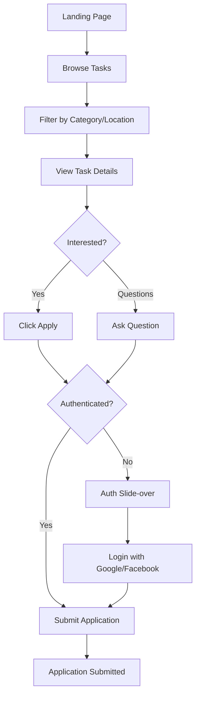
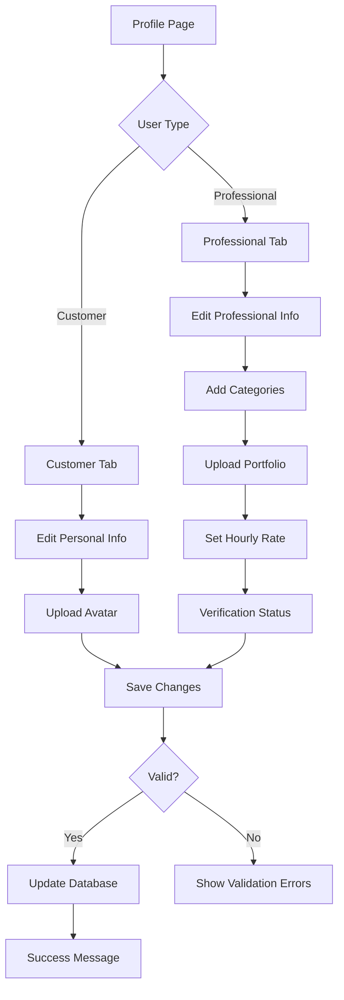
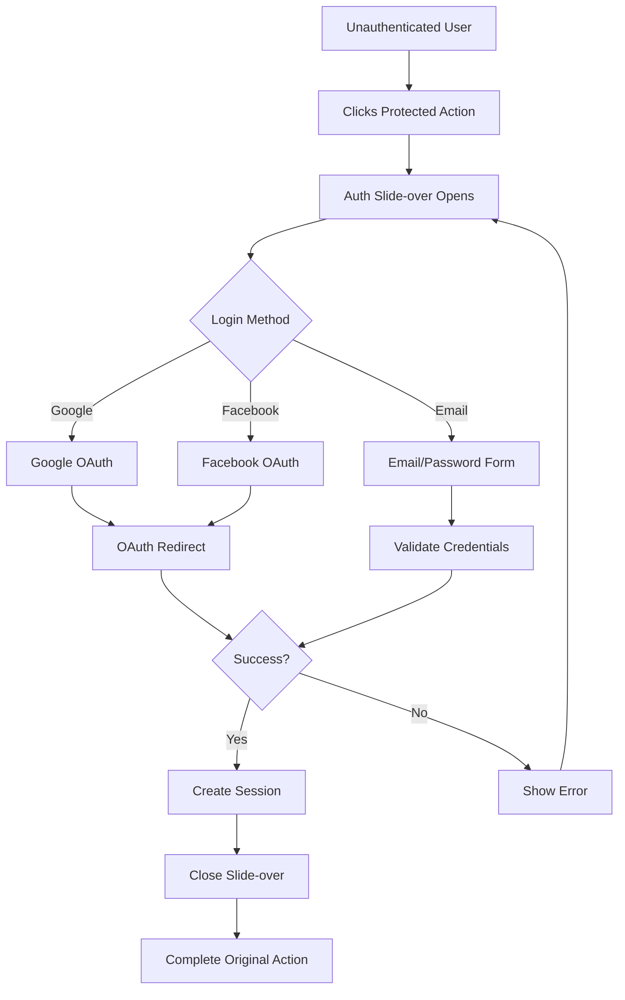

# Professional Journeys

> User flow diagrams for professionals using TaskBridge (Trudify) platform.

This document describes the main user journeys for professionals who want to find work and connect with customers.

## Table of Contents

- [Finding Work](#finding-work)
- [Profile Management](#profile-management)
- [Authentication Flow](#authentication-flow)

---

## Finding Work

The complete flow for professionals discovering and applying to tasks.



### Key Steps

1. **Discovery**: Professional browses available tasks from landing page
2. **Filtering**: Apply filters by category, location, budget range
3. **Evaluation**: Review task details to assess fit
4. **Decision**: Choose to apply or ask clarifying questions
5. **Authentication**: Login/register if not authenticated
6. **Application**: Submit proposal with price and message

### Filter Options

| Filter | Options | Purpose |
|--------|---------|---------|
| Category | 26 main categories, 135 subcategories | Match professional skills |
| Location | 8 Bulgarian cities | Filter by service area |
| Budget | Range slider | Match price expectations |
| Status | Open, In Progress | Find available tasks |

### Application Components

When applying to a task, professionals provide:
- **Proposed price**: Their quote for the work
- **Message**: Cover letter explaining their fit
- **Portfolio reference**: Link to relevant past work (optional)

---

## Profile Management

Managing professional account and public profile.



### Professional Profile Fields

| Field | Description | Required |
|-------|-------------|----------|
| First Name | Professional's first name | Yes |
| Last Name | Professional's last name | Yes |
| Email | Contact email | Yes |
| Phone | Contact phone number | Yes |
| City | Primary service area | Yes |
| Bio | Professional description | No |
| Service Categories | Skills and expertise areas | Yes |
| Hourly Rate | Standard pricing | No |
| Portfolio | Work samples and photos | No |
| Avatar | Profile picture | No |

### Service Categories

Professionals can select multiple categories from:
- 26 main categories (e.g., Handyman, Web Development, Cleaning)
- 135 subcategories (e.g., Plumber, Electrician, React Developer)

See [Category System](../README.md#category--subcategory-system) for complete list.

### Verification Options

Professionals can enhance their profile trust with:

| Verification | Method | Benefit |
|-------------|--------|---------|
| **Phone** | SMS confirmation | +Trust badge |
| **Email** | Email link confirmation | +Trust badge |
| **VAT Number** | Business registration | +Business badge |
| **ID Verification** | Document upload | +Verified badge |

### Portfolio Management

Professionals can showcase their work through:
- **Photos**: Before/after images, completed projects
- **Descriptions**: Details about each portfolio item
- **Categories**: Link portfolio items to service categories

---

## Authentication Flow

The authentication process for accessing protected features.



### Supported Authentication Methods

| Method | Provider | Status |
|--------|----------|--------|
| Google OAuth | Google | Available |
| Facebook OAuth | Facebook | Available |
| Email/Password | Built-in | Planned |
| Phone (SMS) | Twilio/Vonage | Planned |

### Protected Actions for Professionals

These actions trigger the authentication flow:
- Applying to tasks
- Asking questions on tasks
- Accessing profile page
- Managing applications
- Viewing work history

---

## Application Lifecycle

After submitting an application, professionals can track its status:

```
Application Submitted
        │
        ▼
    ┌───────────┐
    │  Pending  │ ◄── Waiting for customer review
    └───────────┘
        │
        ├─────────────────┐
        ▼                 ▼
┌───────────────┐  ┌────────────┐
│   Accepted    │  │  Rejected  │
└───────────────┘  └────────────┘
        │
        ▼
┌───────────────┐
│  In Progress  │ ◄── Work begins
└───────────────┘
        │
        ▼
┌───────────────┐
│   Completed   │ ◄── Work finished, review exchanged
└───────────────┘
```

### Application States

| Status | Description | Professional Actions |
|--------|-------------|---------------------|
| **Pending** | Awaiting customer review | Withdraw, Edit message |
| **Accepted** | Hired for the task | Contact customer, Start work |
| **Rejected** | Application declined | View reason, Apply to others |
| **In Progress** | Work in progress | Update status, Message customer |
| **Completed** | Work finished | Leave review, Request payment |

---

## Related Documentation

- [Customer Journeys](./customer-journeys.md) - Flows for customers
- [README.md](../README.md) - Main project documentation
- [PRD.md](../PRD.md) - Product Requirements Document
